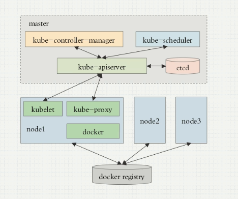
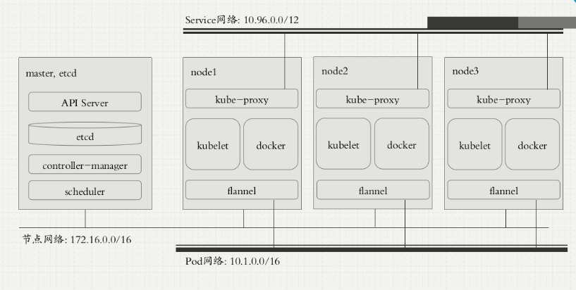
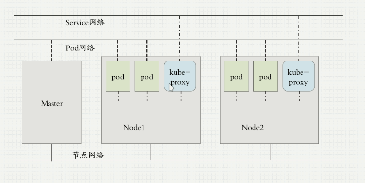

# 基础概念

---

  - CI: 持续集成
  - CD: 持续交付，Delivery
  - CD: 持续部署，Deployment
  - DevOps: 不是一种技术，而是一种思想，一种方式

## k8s优势
  - 自动装箱
  - 自我修复
  - 水平扩展
  - 服务发现
  - 负载均衡
  - 自动发布和回滚
  - 秘钥和配置管理、存储编排、批量处理执行

## k8s架构
  - k8s集群架构  
    
    
  - master/node
    - master:  API Server,Scheduler,Controller-Manager
    - node: kubelet,容器引擎(docker),kube-proxy
    - etcd: 存储
    - 参考上边的架构图，所有的请求都是通过api-server进行联通，并且都是通过https(ca)的方式进行通信，而数据是存储在etcd数据库中；etcd可以单独部署，也可以放到集群节点上；为了保障高可用，需要对etcd api-server controller scheduler做高可用
  - 部署方式相关
    - 是否做高可用: 对master上的所有组件以及etcd数据库做高可用
    - 二进制方式部署：把组件以二进制的方式安装，比如yum、apt或者直接用官方的二进制包，但是需要手动创建ca证书，用于各个组件之间通信
    - pod方式部署： 把组件全都部署为pod，这些组件使用host的名称空间，使用kubeadm命令自动化部署，方便快捷，但是，容器镜像全在国外，默认访问不到，可以指定为阿里仓库或者微软仓库，也可以自己搭建私有仓库
    - minikube: 相当于一个运行在本地的Kubernetes单节点，也就能当试验用，不能当做生产环境用
  - AddOns: 附件
    - kubernetes附加组件
    - cni网络: flannel calico 网络 网络策略
    - coredns  域名解析
  - Pod
    - Pod是最小管理单元
    - 自主式Pod
    - 控制器管理的Pod
      - 各种各样的控制器，用来管理不同类型的pod
      - 副本数量
      - HPA控制器 水平pod自动伸缩控制器，自动监控状态，自动伸缩
    - Pod类型：按照是否有状态、是否需要存储来区分
      - 无状态无存储
      - 无状态有存储
      - 有状态无存储
      - 有状态有存储
    - Pod网络
      - Pod运行在同一个网络之中,可以相互ping通
  - Service
    - 为一组提供相同功能的pod,添加Service层，请求先到Service，Service从这一组pod中找一个进行响应,即使pod变了，Service通过pod label selecter选择这些pod，为这些pod提供一个固定的统一的访问入口
    - Service不是一个程序，可以是iptables防火墙策略，也可以是ipvs
    - 通过coredns为每个Service分配固定的域名,通过这个域名进行访问这个Service
    - Service网络，虚拟的，是iptables或者ipvs规则，又叫集群网络
  - k8s网络模型
    - host网络
    - 集群网络
    - Pod网络
    - 集群外部访问集群内的pod时，先进入到host网络，然后转到集群网络，然后由集群网络代理至pod网络
    - 网络模型图  
    
  - k8s多种通信
    - 同一个Pod内多个容器间通信:同一个Pod内的多个容器，共用一个网络名称空间，拥有相同的ip，这些容器通信，可以用lo网卡，及127
    - 各个pod之间通信: 两种情况，在同一个node节点上的pod和不在同一个节点之间的;虽然有多种方法实现各个pod之间通信，但是效率都不咋地，目前k8s使用的是overlay network叠加网络，性能相对好一些;其实pod之间直接通信的情况很少，大部分是pod访问service，service访问pod，即pod与service之间通信;还可以使用直接路由的方式进行pod之间通信
    - pod与Service之间的通信: Service 到 pod 通过pod label Selecter来访问；pod 到 Service，实际上，请求是先到网关，而pod的网关，一般都是node节点上的一块虚拟网卡，请求到达网关后，即node节点，即可由iptables规则进行后续处理
    - pod、service发生变化之后，由node节点上的kube-proxy将这些变化反应到iptables或ipvs规则里
    - 为了保障各种通信的安全，全部使用ca证书来保障安全性
  - k8s网络CNI插件体系：
    - CNI: 容器网络接口，只要遵循cni接口，就能作为k8s的网络解决方案
    - 需要提供的功能：为pod、service提供ip地址;为网络访问提供访问策略，类似网络防火墙
    - 常用：
      - flannel 只支持网络配置，不支持网络策略，但是配置简单
      - calico 同时支持网络配置和网络策略，但是部署复杂
      - canel: calico+flannel  使用flannel的网络配置，使用calico的网络策略
      - 其他 略
  - k8s名称空间
    - 通过名称空间，提供一个边界，然后可以通过网络策略，来设置名称空间之间、名称空间内部pod之间的访问策略
    - 像阿里云，不同的租户就处于不同的名称空间，然后通过网络策略进行隔离，要不然就能访问到别人的服务器了，很不安全

