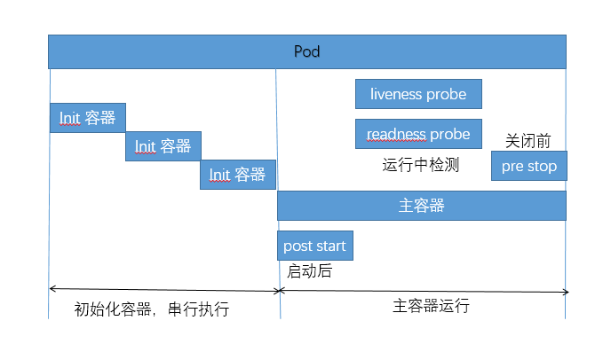

# 跟随马哥视频教程一步一步了解k8s

**也全是知识点**

## pod的生命周期

**除了视频，还参考了一篇博客  <https://www.cnblogs.com/linuxk/p/9569618.html>**

### 在pod生命周期中重要行为

- 初始化容器  主容器启动前可以完成初始化容器，初始化容器可以有多个，他们是串行执行的，执行完成后就推出了
- 主容器启动后钩子 在主程序刚刚启动的时候可以指定一个post start 主程序启动开始后执行一些操作
- 主容器结束前钩子 在主程序结束前可以指定一个 pre stop 表示主程序结束前执行的一些操作
- 容器探测 在程序启动后可以做两类检测 liveness probe（存活性探测） 和 readiness probe（就绪性探测）----存活性，表示主程序正在运行，但是运行不代表提供的服务运行正常，所以需要就绪性探测
- 

### POD的状态

- Pending 挂起  条件不能满足调度条件，或者调度尚未完成，pod会挂起
- Running 运行中
- Failed 失败
- Succeeded 成功
- Unknown  与kubelet通信失败

### 容器探测
- 探测类型（探针）
  - 存活性探测 liveness probe 
  - 就绪性探测 readiness probe
- 探测方式
  - 执行指定的命令 ExecAction
  - 发送TCP请求    TCPSocketAcion
  - 发送http请求   HTTPGetAction
- 重要性
  - services通过标签选择器来选择pod，如果pod创建之后，没有进行这些探测，直接关联到services，当请求进来的时候，有可能无法正常响应，因此需要做好存活性探测和就绪性探测，探测成功之后，才能关联到services
  
### pod的重启策略    restartPolicy
- Always 一旦pod中的容器挂了，就重启---默认是这个
- OnFailure 发生错误时重启----另外一层意思是正常结束的不会重启
- Never  不重启
- 重启策略---第一次重启是马上重启，第二次重启，延时n秒重启，第三次，延时更多时间重启


## 试验

### 查看帮助文档
```bash
# kubectl explain pods.spec.containers.livenessProbe  （readiness与liveness参数差不多）
exec <Object>
httpGet <Object>
tcpSocket <Object>
failureThreshold    #检测几次失败之后，就认为确实失败了----防止误判，多给几次机会，默认3
periodSeconds  #探测间隔时长，默认10s
initialDelaySeconds  #容器启动多长时间之后开始探测-----有些启动比较慢，马上探测的话可能还没正常运行呢
```
### 试验liveness exec探针 liveness-exec.yaml
```bash
vim liveness-exec.yaml

apiVersion: v1
kind: Pod
metadata:
  name: liveness-exec-pod
  namespace: default
spec:
  containers:
    - name: liveness-exec-container
      image: busybox:latest
      imagePullPolicy: IfNotPresent
      command: ["/bin/sh","-c","touch /tmp/healthy;sleep 30;rm -rf /tmp/healthy;sleep 3600"]     #创建一个文件，30s后删除
      livenessProbe:
        exec:
          command: ["test","-e","/tmp/healthy"]                                                  #存活性检测，检测文件是否存在
        initialDelaySeconds: 1                                                                   #容器启动1s后开始探测
        periodSeconds: 3                                                                         #探测间隔3s

#一段时间后
[root@master test]# kubectl get pods
NAME                READY   STATUS    RESTARTS   AGE
liveness-exec-pod   1/1     Running   4          4m51s

[root@master test]# kubectl describe pod liveness-exec-pod
 Restart Count:  4
 Liveness:       exec [test -e /tmp/healthy] delay=1s timeout=1s period=3s #success=1 #failure=3

#########

vim liveness-httpget.yaml
apiVersion: v1
kind: Pod
metadata:
  name: liveness-httpget-pod
  namespace: default
spec:
  containers:
    - name: liveness-httpget-container
      image: ikubernetes/myapp:v1
      imagePullPolicy: IfNotPresent
      livenessProbe:
        httpGet:
          port: 80

#上边liveness探针中port直接写的端口值，也可以先定义ports字段，然后在探针中引用端口名称，如下
spec:
  containers:
    - name: liveness-httpget-container
      image: ikubernetes/myapp:v1
      imagePullPolicy: IfNotPresent
      ports:
        - name: http
          containerPort: 80
      livenessProbe:
        httpGet:
          port: http
        initialDelaySeconds: 1
        periodSeconds: 3
```

### 试验钩子 lifecycle

```bash
[root@master ~]# kubectl explain pods.spec.containers.lifecycle
postStart    <Object>
preStop      <Object>
[root@master ~]# kubectl explain pods.spec.containers.lifecycle.postStart
  exec <Object>
  httpGet      <Object>
  tcpSocket    <Object>
  
 vim poststart-pod.yaml
apiVersion: v1
kind: Pod
metadata:
  name: poststart-pod
  namespace: default
spec:
  containers:
    - name: busybox-httpd
      image: busybox:latest
      imagePullPolicy: IfNotPresent
      command: ["/bin/httpd"]
      args: ["-f","-h","/tmp"]   #容器的主进程，启动之后，会执行postStart
      lifecycle:
        postStart:
          exec:
            command: ["/bin/sh","-c","echo hello >> /tmp/index.html"]
```