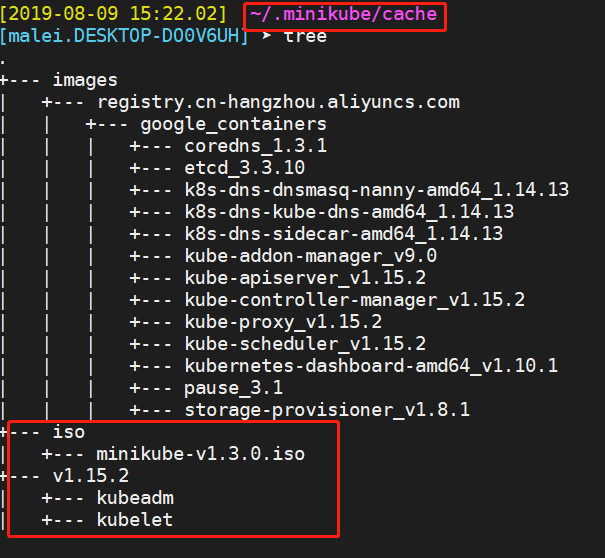

# minikube安装使用

## 参考：
  - 阿里minikube <https://yq.aliyun.com/articles/221687>
  - mini官方安装文档 <https://kubernetes.io/docs/tasks/tools/install-minikube/>
  - minikube官方github地址 <https://github.com/kubernetes/minikube>

## windows下安装，已提前安装好了vbox
1. 手动下载minikube.exe和kubectl.exe 放到PATH里，方便直接使用
2. 安装
minikube  start   --image-mirror-country=cn     # 加上后边这个参数，默认的镜像库就变成了 registry.cn-hangzhou.aliyuncs.com

安装过程中，会去https://storage.googleapis.com/minikube下载东西，有可能下载失败，
可以手动去别的地方下载，包含三个东西  minikube-v1.3.0.iso   kubeadm  kubelet 
iso放到 .minikube/cache/iso/下
两个命令文件，放到 .minikube/cache/VERSION/下   VERSION是安装的k8s版本号，比如 v1.15.2

另外  .minikube/cache/images/REGISTRY_ADDR/ 下，存放下载的镜像

3. 目录截图
  .minikube在当前用户的家目录下，这里只截了cache下的目录结构，同级别的还有一些ca证书、配置文件等
  
