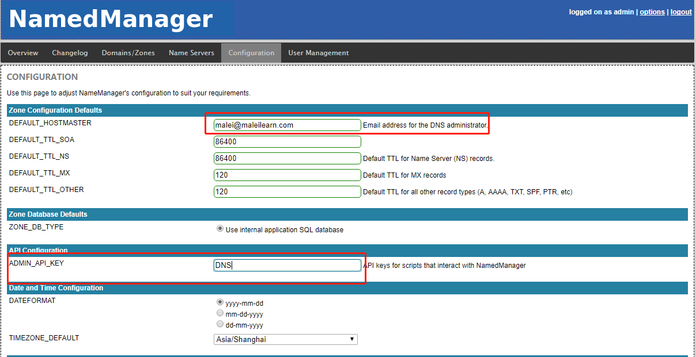
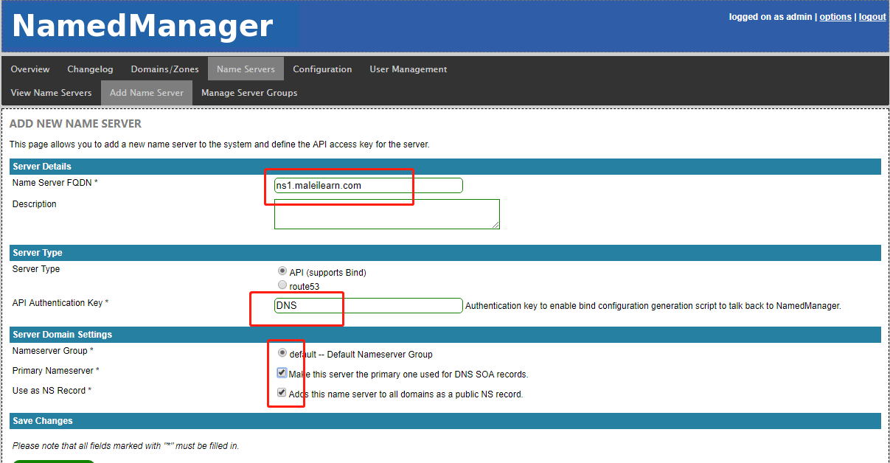

# DNS web管理工具之NamedManager

## 概述
  - bind是提供域名解析服务的软件
  - NamedManager是一个配置bind的web页面，使用的语言是php
  - NamedManager包含另个主要模块 NamedManager-bind和 NamedManager-www
  - 比较适用于自己搭建内网使用的域名解析服务器
  - 大致的组成部分包括 mysql+bind+httpd+NamedManager

## 补充.仔细读了一遍官方的wiki <https://github.com/jethrocarr/namedmanager/wiki>
  - NamedManager包含两部分
    - namedmanager-www:  提供管理页面以及api接口，数据存放在mysql数据库里
    - namedmanager-bind: 用来调用api接口获取数据，然后将数据写入bind的配置文件---通过定时任务执行php程序，来定时从api获取数据，并写入配置文件---调用api接口时，需要指定认证用的key
    - 根据上边的两条来总结，一个是web服务器，一个是bind服务器，其实是可以分开部署的，并且可以是多个bind服务器
    - web服务器端：httpd+mysql+php+ namedmanager-www页面
    - bind服务器端： bind+ namedmanager-bind+php    namedmanager-bind里的php程序，提供的不是页面，相当于一个客户端，调用NamedManager-www提供的api接口
  
## 参考信息

- https://blog.51cto.com/gdutcxh/2109195
- https://github.com/jethrocarr/namedmanager/wiki/Installation-RPM
- https://repos.jethrocarr.com/pub/amberdms/linux/centos/7/jethrocarr-custom/
- https://github.com/huangyingcai/namedweb#readme
- http://wiki.deimos.fr/NamedManager_:_une_interface_web_agr%C3%A9able_pour_administrer_Bind

## 部署

### 环境说明
  - 使用CentOS 7.6 作为服务器，通过yum安装需要的程序
  
### 安装步骤
  1. 配置yum源(也可以手动rpm命令安装，但是需要自己解决依赖关系)

``` bash
    yum-config-manager --add-repo=https://repos.jethrocarr.com/pub/amberdms/linux/centos/7/jethrocarr-custom/x86_64/
    # 可以手动修改下repo名称什么的,添加gpgcheck=0
```

  2. 安装软件
``` bash
  yum install namedmanager-bind  namedmanager-www 
  # 它的依赖包中，包含了bind、php、httpd等，比较省事
  # 如果分开部署的话，可以一台上边安装namedmanager-bind、一台上边安装namedmanager-www
```

  3. 设置开机自启
``` bash
  systemctl enable named httpd mariadb
```
  
  4. 数据库初始化
``` bash
  systemctl start mariadb  #启动数据库
  mysql_secure_installation  #设置root用户密码，并删除无用的库
  cd /usr/share/namedmanager/resources/; ./autoinstall.pl   
  # 初始化NamedManager数据库，注意输入root用户密码；这个初始化文件，会新建数据库以及用户，并且会自动修改NamedManager的配置文件;  如果不执行前边mysql_secure_installation命令，这一步输入root密码的时候，直接回车就行
```

  5. 配置httpd
``` bash
  vim /etc/httpd/conf/httpd.conf 
  <Directory />
    AllowOverride none
    # Require all denied   # 默认是这个，注释掉，拒绝所有访问
    Require all granted     # 添加这行，允许所有访问
</Directory>

  systemctl restart httpd
  
  # 到这一步，已经可以登录http://xxxxx/namedmanager页面了，用户名是setup 密码setup123  参考后边web端使用

```
  6. 配置bind
``` bash
  echo 'include "/etc/named.namedmanager.conf";' >>  /etc/named.conf # 在bind的配置文件里，添加上包含namedmanager管理的配置文件

  vim /etc/named.conf 
  默认是监听到127上，改成any，允许查询也是
  listen-on port 53 { 127.0.0.1; };   --> listen-on port 53 { any; };
  allow-query     { localhost; };  --> allow-query     { any; };
  
  # 如果使用bind-chroot功能，需要执行下面语句
  # yum install bind-chroot 
  # ln /etc/named.namedmanager.conf /var/named/chroot/etc/named.namedmanager.conf  #创建硬链接，因为chroot之后，根发生了改变
  
  systemctl start named  #启动named服务  此时named服务本身已经可以正常使用了

```

  7. 配置NamedManager-bind
``` bash
  vim /etc/namedmanager/config-bind.php
  ...
  $config["api_url"]              = "http://192.168.36.190/namedmanager";   # 填写namedmanager-www服务器的访问地址，即api接口地址             
  $config["api_server_name"]      = "ns1.maleilearn.com";                       #设置为 为这台dns服务器分配的域名---在页面上设置的时候，需要跟这个保持一致     
  $config["api_auth_key"]         = "DNS";                                  #key，随便填---在页面上设置的时候，需要跟这个保持一致   
  ...

  # 手动同步所有 php -q /usr/share/namedmanager/bind/namedmanager_bind_configwriter.php
  # 该命令会被定时任务一分钟执行一次 /etc/cron.d/目录下

``` 


### web端使用 

  1. 登录
  > 访问地址 http://192.168.36.190/namedmanager  
  > 默认的用户名密码  setup/setup123
  > 登录之后，先去修改用户名和密码，比如改成admin/123123什么的
  
  2. 配置
   - 在 configuration 菜单，设置邮箱，设置之前在config-bind.php里配置的api key值
   - 
   - 在 Name Server 菜单，添加新server，设置name server fqdn，即在config-bind配置的api_server_name,设置api key值
   - 
   - 配置好之后，NamedManager会一分钟同步一次配置文件和日志文件到bind，注意观察server status
   - 在 Domains/Zones 菜单，添加正向解析(standard domain)，输入域名部分，如maleilearn.com 注意，结尾没有点
   - 添加反向解析(reverse domain),输入要反向解析的ip端，比如192.168.36.0/24
   - 添加解析记录，在添加好的domains/zones里，正向解析的那行，有domain recored，添加a记录，比如name是www,content是192.168.36.3，勾选reverse PTR之后，会自动添加相应的反向解析
   - 添加成功之后，可以去/var/named/目录查看生成的maleilearn.com.zone以及反向解析用的36.168.192.in-addr.arpa.zone 
  3. 补充-组
   - 在name server菜单下，有个manage server groups，默认有个default组，经测试，如果有多个bind服务器，且添加的多个nameserver属于同一个组，那为多个nameserver生成的多个zone文件，会同时下发的所有bind服务器，因为它们属于同一个组；比如同一个组下的两个nameserver，生成的文件maleilearn.top.zone  maleilearn.info.zone，在两台bind服务器上都有这两个文件；如果是不同的组，一个服务器上只有一个zone文件
  4. 验证
   - 方法一： 命令nslookup
``` bash
    语法：nslookup   要解析的地址   dns服务器地址
    nslookup www.maleilearn.com 192.168.36.190  可以得到192.168.36.3
    nslookup 192.168.36.3  192.168.36.190  www.maleilearn.com
    nslookup 回车
    set q=ns  #指定查询ns记录
    maleilearn.com # 查询这个域名对应的ns记录
    set q=mx       # 指定查询邮箱记录
    maleilearn.com
    set q=a         # 指定查询a记录
    www.maleilearn.com
```
   - 方法二： dig (linux)
``` bash
    dig -t xx  FQDN/DOMAIN  [@NAMESERVER]  #@指定使用的dns服务器，省略的话使用默认的
    dig -t NS  maiellearn.com 
    dig -t A   www.maleilearn.com
    dig -t A  www.maleilearn.com @192.168.16.190
    dig -x   192.168.36.104  #反向查询
``` 
   - 方法三： 正常使用
``` bash    
    给客户端电脑配置dns地址为搭建的NamedManager服务器地址，即192.168.36.190，然后通过浏览器访问配置的那些域名
```


    

  
  
